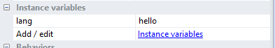

# Construct 2 Translation Plugin

## Translation made easy

[Plugin ACEs table](./acetable.md)

### Configuration files
There are two types of files : 
* The language list
* The languages files

### Language list
```javascript
{
   "version":0.2,
   "fr":{                //language identifier 
      "path":"fr.lang",  //path of the file that contains French translations
      "name":"Français"  //Friendly name of the language
   },
   "en":{
      "path":"en.lang",
      "name":"English"
   }
}
```

### Language file 
Here the file is **en.lang**
```javascript
{
    "hello" : "Hello, world!",
    "stupid_string" : "This is a stupid string", //"identifier" : "value"
    "try" : "try try try",
    "thanks" : "Thank for using."
}
```

You can also make nested identifiers to make it more clean
```javascript
{
    "hello" : "Hello, world!",
    "menu" : {
    	"newgame" : "New Game",
    	"continue" : "Continue"
    }
}
```

## The hard way (All objects supported)
You have to set manually for each field the lang you want to target and the identifier

Text > Set text to **ProjectTranslation.GetString(currentLang, "hello")**

**currentLang** is my current language, say **fr** or **en**
**"hello"** is the identifier

## The easy way
### Supported Objects
* Text
* Button
* Spritefont/Spritefont+

### How to set up
* Create a new text using the default text plugin
* Create a new instance variable called **lang** and assign an identifier to its value

* Call the Action **Translate all default text plugins to** and pass it the language
* All the text that have a **lang** instance variables are translated to the right text

No more pain :)

*Note* : To access nested identifiers use *dot notation* : 
`menu.continue` will output `Continue`

*Note2* : To access global variables use **@fullVariableName** 
